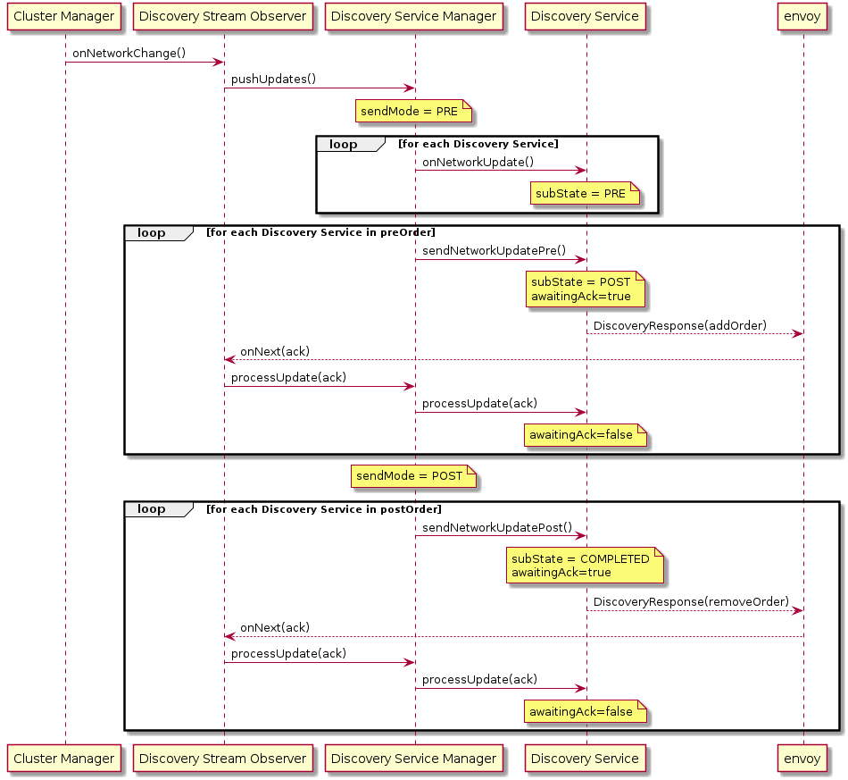

DiscoveryStreamObservers are instantiated when envoy opens an ADS session. They register themselves with the ClusterEventSource implementation you provide when constructing the AggregatedDiscoveryService (in our example this is named ClusterManager.)
The ClusterEventSource should provide network updates to all of it's registered listeners.

The CommonDiscoveryStreamObserver (DSO) does very little itself, but delegates to DiscoveryServiceManager (DSM.) DSM handles sequencing of resource changes triggered by a network update, and calls the DiscoveryService (DS) implementations which manage
the individual state of each discovery service (e.g. RDS, CDS, LDS, EDS) for that client. DSM is responsible for deciding what order the DSes should be invoked in.

In the following diagram note that the loop progressing is dependent on Envoy responding, it's implemented as linked state machines, but it's simpler to illustrate as a loop.  We don't advance to the next discovery service until envoy has acked the
resources from previous one. We will respond with additional resources if requested by envoy regardless of state, however new calls to onNetworkChange will be held (in a StateBacklog implementation) until sending of all resource changes related to
the previous network change are completed.

